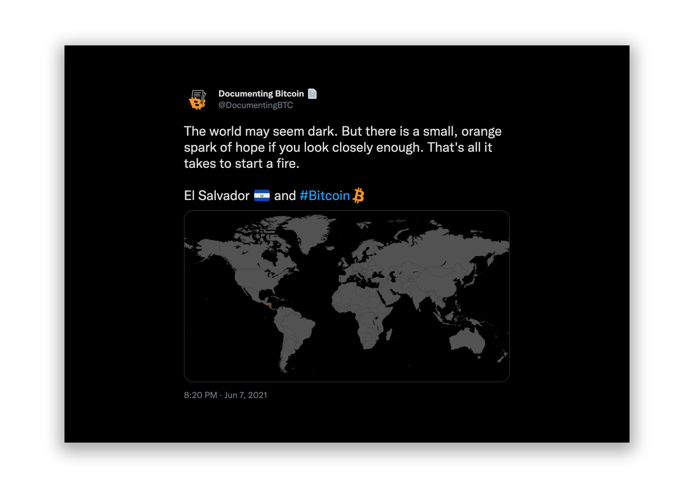

# Bitcoin Domino

A visualisation of the adoption of Bitcoin across the world.

**_This was a fun experiment that I am no longer going to maintain, so I am archiving this repository._**

## Context

On 7th September 2021, El Salvador's [Bitcoin Law](https://en.wikipedia.org/wiki/Bitcoin_Law) took effect, making it the first country in the world to recognise Bitcoin as legal tender.

The potential success of this experiment represents a game-theoretical challenge to other governments, whose nation-states can benefit from becoming early adopters of the emerging money technology.

This will generate a domino effect, with other countries falling to the inevitability of Bitcoin becoming the new global reserve currency.

## Goal

This project aims to track the journey to a Bitcoin standard, by providing a simple visualisation of the world, highlighting those places where adoption has advanced.

## Credit

The inspiration for this project came from a [tweet](https://twitter.com/DocumentingBTC/status/1401982305846104064?s=20) by [@DocumentingBTC](https://twitter.com/DocumentingBTC) on the day the Bitcoin Law was presented in El Salvador.

